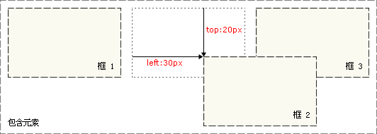

# CSS 定位

## 定位概述

CSS 定位 (Positioning) 属性允许你对元素进行定位。**

### CSS 定位和浮动

CSS 为定位和浮动提供了一些属性，利用这些属性，可以建立列式布局，将布局的一部分与另一部分重叠，还可以完成多年来通常需要使用多个表格才能完成的任务。

定位的基本思想很简单，它允许你定义元素框相对于其正常位置应该出现的位置，或者相对于父元素、另一个元素甚至浏览器窗口本身的位置。显然，这个功能非常强大，也很让人吃惊。要知道，用户代理对 CSS2 中定位的支持远胜于对其它方面的支持，对此不应感到奇怪。

另一方面，CSS1 中首次提出了浮动，它以 Netscape 在 Web 发展初期增加的一个功能为基础。浮动不完全是定位，不过，它当然也不是正常流布局。我们会在后面的章节中明确浮动的含义。

### 一切皆为框

div、h1 或 p 元素常常被称为块级元素。这意味着这些元素显示为*一块内容*，即“块框”。与之相反，span 和 strong 等元素称为“行内元素”，这是因为它们的内容显示在行中，即“行内框”。

您可以使用 [display 属性](http://www.w3school.com.cn/cssref/pr_class_display.asp)改变生成的框的类型。这意味着，通过将 display 属性设置为 block，可以让行内元素（比如 <a> 元素）表现得像块级元素一样。还可以通过把 display 设置为 none，让生成的元素根本没有框。这样的话，该框及其所有内容就不再显示，不占用文档中的空间。

但是在一种情况下，即使没有进行显式定义，也会创建块级元素。这种情况发生在把一些文本添加到一个块级元素（比如 div）的开头。即使没有把这些文本定义为段落，它也会被当作段落对待：

```
<div>
some text
<p>Some more text.</p>
</div>

```

在这种情况下，这个框称为无名块框，因为它不与专门定义的元素相关联。

块级元素的文本行也会发生类似的情况。假设有一个包含三行文本的段落。每行文本形成一个无名框。无法直接对无名块或行框应用样式，因为没有可以应用样式的地方（注意，行框和行内框是两个概念）。但是，这有助于理解在屏幕上看到的所有东西都形成某种框。

### CSS 定位机制

CSS 有三种基本的定位机制：普通流、浮动和绝对定位。

除非专门指定，否则所有框都在普通流中定位。也就是说，普通流中的元素的位置由元素在 (X)HTML 中的位置决定。

块级框从上到下一个接一个地排列，框之间的垂直距离是由框的垂直外边距计算出来。

行内框在一行中水平布置。可以使用水平内边距、边框和外边距调整它们的间距。但是，垂直内边距、边框和外边距不影响行内框的高度。由一行形成的水平框称为*行框（Line Box）*，行框的高度总是足以容纳它包含的所有行内框。不过，设置行高可以增加这个框的高度。

在下面的章节，我们会为您详细讲解相对定位、绝对定位和浮动。

### CSS position 属性

通过使用 [position 属性](http://www.w3school.com.cn/cssref/pr_class_position.asp)，我们可以选择 4 种不同类型的定位，这会影响元素框生成的方式。

position 属性值的含义：

- static

  元素框正常生成。块级元素生成一个矩形框，作为文档流的一部分，行内元素则会创建一个或多个行框，置于其父元素中。

- relative

  元素框偏移某个距离。元素仍保持其未定位前的形状，它原本所占的空间仍保留。

- absolute

  元素框从文档流完全删除，并相对于其包含块定位。包含块可能是文档中的另一个元素或者是初始包含块。元素原先在正常文档流中所占的空间会关闭，就好像元素原来不存在一样。元素定位后生成一个块级框，而不论原来它在正常流中生成何种类型的框。

- fixed

  元素框的表现类似于将 position 设置为 absolute，不过其包含块是视窗本身。

提示：相对定位实际上被看作普通流定位模型的一部分，因为元素的位置相对于它在普通流中的位置。

## 相对定位

> **设置为相对定位的元素框会偏移某个距离。元素仍然保持其未定位前的形状，它原本所占的空间仍保留。**

相对定位是一个非常容易掌握的概念。如果对一个元素进行相对定位，它将出现在它所在的位置上。然后，可以通过设置垂直或水平位置，让这个元素“相对于”它的起点进行移动。

如果将 top 设置为 20px，那么框将在原位置顶部下面 20 像素的地方。如果 left 设置为 30 像素，那么会在元素左边创建 30 像素的空间，也就是将元素向右移动。

```css
#box_relative {
  position: relative;
  left: 30px;
  top: 20px;
}
```

如下图所示：



注意，在使用相对定位时，无论是否进行移动，元素仍然占据原来的空间。因此，移动元素会导致它覆盖其它框。

## 绝对定位

> **设置为绝对定位的元素框从文档流完全删除，并相对于其包含块定位，包含块可能是文档中的另一个元素或者是初始包含块。元素原先在正常文档流中所占的空间会关闭，就好像该元素原来不存在一样。元素定位后生成一个块级框，而不论原来它在正常流中生成何种类型的框。**

绝对定位使元素的位置与文档流无关，因此不占据空间。这一点与相对定位不同，相对定位实际上被看作普通流定位模型的一部分，因为元素的位置相对于它在普通流中的位置。

普通流中其它元素的布局就像绝对定位的元素不存在一样：

```css
#box_relative {
  position: absolute;
  left: 30px;
  top: 20px;
}
```

如下图所示：


绝对定位的元素的位置相对于*最近的已定位祖先元素*，如果元素没有已定位的祖先元素，那么它的位置相对于*最初的包含块*。

对于定位的主要问题是要记住每种定位的意义。所以，现在让我们复习一下学过的知识吧：相对定位是“相对于”元素在文档中的初始位置，而绝对定位是“相对于”最近的已定位祖先元素，如果不存在已定位的祖先元素，那么“相对于”最初的包含块。

注释：根据用户代理的不同，最初的包含块可能是画布或 HTML 元素。

提示：因为绝对定位的框与文档流无关，所以它们可以覆盖页面上的其它元素。可以通过设置 [z-index 属性](http://www.w3school.com.cn/cssref/pr_pos_z-index.asp)来控制这些框的堆放次序。

## 浮动

> **浮动的框可以向左或向右移动，直到它的外边缘碰到包含框或另一个浮动框的边框为止。**
>
> **由于浮动框不在文档的普通流中，所以文档的普通流中的块框表现得就像浮动框不存在一样。**
>

请看下图，当把框 1 向右浮动时，它脱离文档流并且向右移动，直到它的右边缘碰到包含框的右边缘：


再请看下图，当框 1 向左浮动时，它脱离文档流并且向左移动，直到它的左边缘碰到包含框的左边缘。因为它不再处于文档流中，所以它不占据空间，实际上覆盖住了框 2，使框 2 从视图中消失。

如果把所有三个框都向左移动，那么框 1 向左浮动直到碰到包含框，另外两个框向左浮动直到碰到前一个浮动框。


如下图所示，如果包含框太窄，无法容纳水平排列的三个浮动元素，那么其它浮动块向下移动，直到有足够的空间。如果浮动元素的高度不同，那么当它们向下移动时可能被其它浮动元素“卡住”：


### CSS float 属性

在 CSS 中，我们通过 float 属性实现元素的浮动。

如需更多有关 float 属性的知识，请访问参考手册：[CSS float 属性](http://www.w3school.com.cn/cssref/pr_class_float.asp)。

### 行框和清理

浮动框旁边的行框被缩短，从而给浮动框留出空间，行框围绕浮动框。

因此，创建浮动框可以使文本围绕图像：


要想阻止行框围绕浮动框，需要对该框应用 [clear 属性](http://www.w3school.com.cn/cssref/pr_class_clear.asp)。clear 属性的值可以是 left、right、both 或 none，它表示框的哪些边不应该挨着浮动框。

为了实现这种效果，在被清理的元素的*上外边距*上添加足够的空间，使元素的顶边缘垂直下降到浮动框下面：


这是一个有用的工具，它让周围的元素为浮动元素留出空间。

让我们更详细地看看浮动和清理。假设希望让一个图片浮动到文本块的左边，并且希望这幅图片和文本包含在另一个具有背景颜色和边框的元素中。您可能编写下面的代码：

```
.news {
  background-color: gray;
  border: solid 1px black;
  }

.news img {
  float: left;
  }

.news p {
  float: right;
  }

<div class="news">

<p>some text</p>
</div>

```

这种情况下，出现了一个问题。因为浮动元素脱离了文档流，所以包围图片和文本的 div 不占据空间。

如何让包围元素在视觉上包围浮动元素呢？需要在这个元素中的某个地方应用 clear：


不幸的是出现了一个新的问题，由于没有现有的元素可以应用清理，所以我们只能添加一个空元素并且清理它。

```
.news {
  background-color: gray;
  border: solid 1px black;
  }

.news img {
  float: left;
  }

.news p {
  float: right;
  }

.clear {
  clear: both;
  }

<div class="news">

<p>some text</p>
<div class="clear"></div>
</div>

```

这样可以实现我们希望的效果，但是需要添加多余的代码。常常有元素可以应用 clear，但是有时候不得不为了进行布局而添加无意义的标记。

不过我们还有另一种办法，那就是对容器 div 进行浮动：

```
.news {
  background-color: gray;
  border: solid 1px black;
  float: left;
  }

.news img {
  float: left;
  }

.news p {
  float: right;
  }

<div class="news">

<p>some text</p>
</div>
```

这样会得到我们希望的效果。不幸的是，下一个元素会受到这个浮动元素的影响。为了解决这个问题，有些人选择对布局中的所有东西进行浮动，然后使用适当的有意义的元素（常常是站点的页脚）对这些浮动进行清理。这有助于减少或消除不必要的标记。

事实上，W3School 站点上的所有页面都采用了这种技术，如果您打开我们使用 CSS 文件，您会看到我们对页脚的 div 进行了清理，而页脚上面的三个 div 都向左浮动。

### CSS clear 属性

我们刚才详细讨论了 CSS 清理的工作原理和 clear 属性应用方法。如果您希望学习更多有关 clear 属性的知识，请访问参考手册：[CSS clear 属性](http://www.w3school.com.cn/cssref/pr_class_clear.asp)。

## CSS 定位属性

CSS 定位属性允许你对元素进行定位。

| 属性             | 描述                             |
| -------------- | ------------------------------ |
| position       | 把元素放置到一个静态的、相对的、绝对的、或固定的位置中。   |
| top            | 定义了一个定位元素的上外边距边界与其包含块上边界之间的偏移。 |
| right          | 定义了定位元素右外边距边界与其包含块右边界之间的偏移。    |
| bottom         | 定义了定位元素下外边距边界与其包含块下边界之间的偏移。    |
| left           | 定义了定位元素左外边距边界与其包含块左边界之间的偏移。    |
| overflow       | 设置当元素的内容溢出其区域时发生的事情。           |
| clip           | 设置元素的形状。元素被剪入这个形状之中，然后显示出来。    |
| vertical-align | 设置元素的垂直对齐方式。                   |
| z-index        | 设置元素的堆叠顺序。                     |